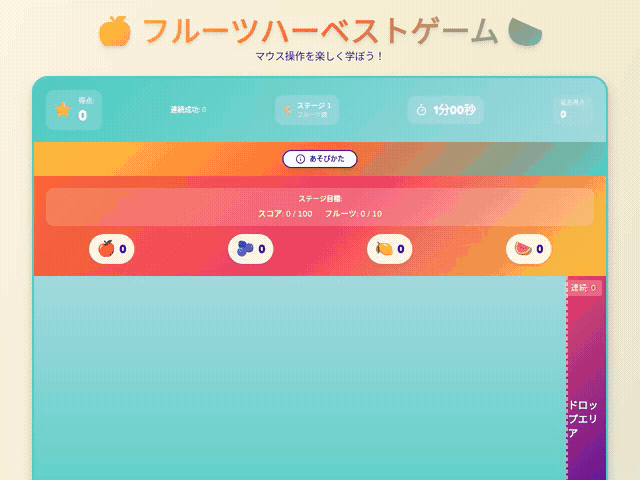
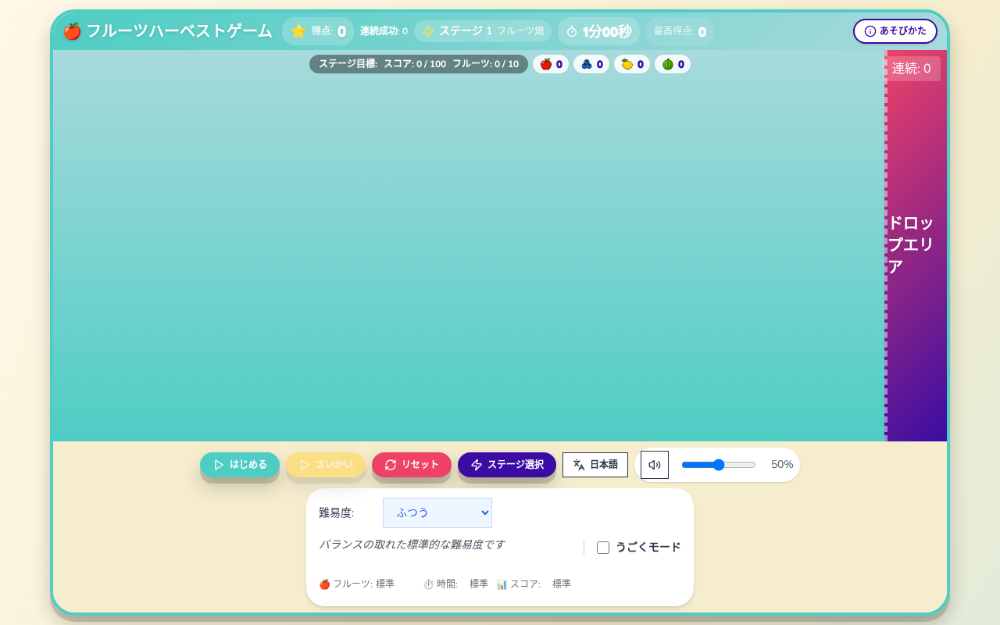
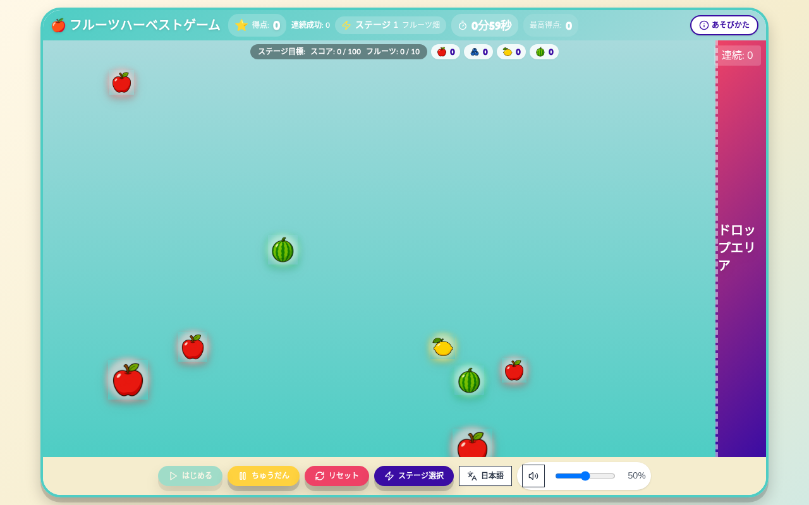
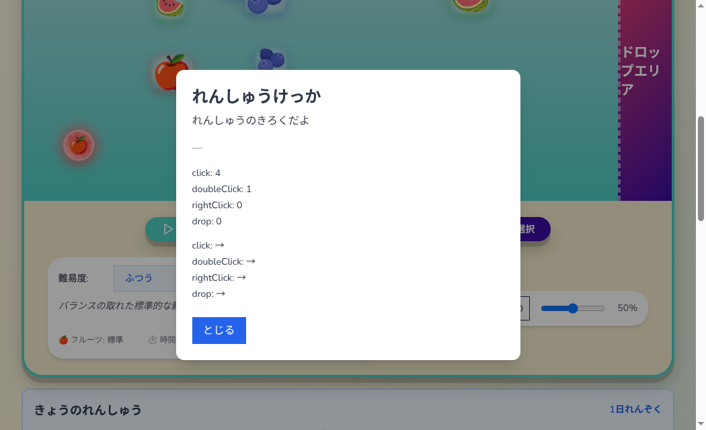
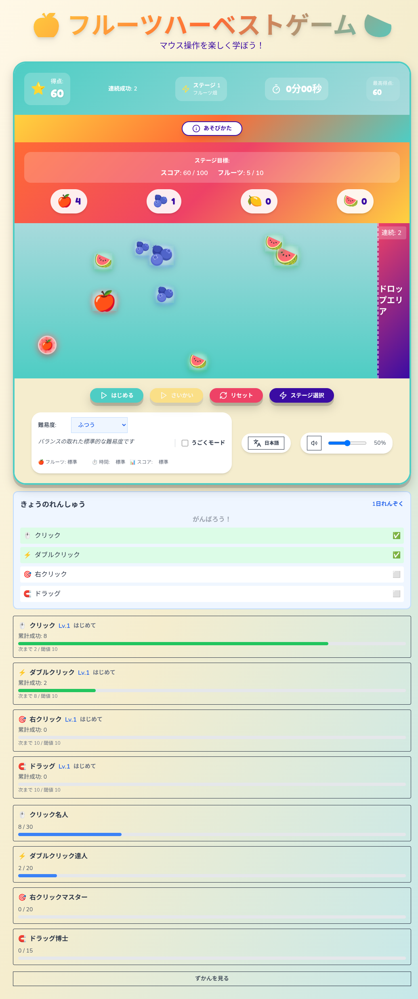
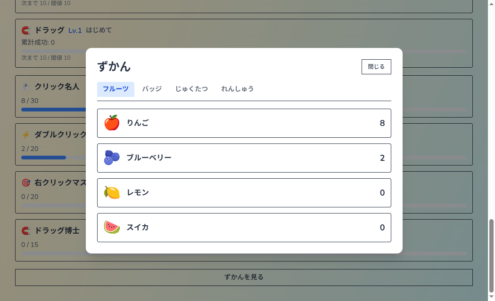
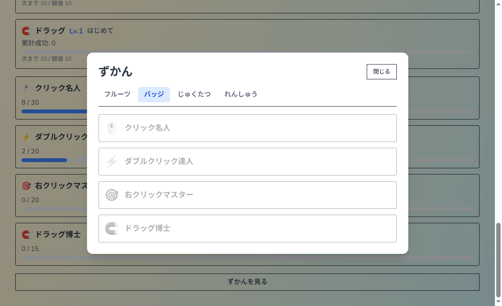

# 🖱️ マウス操作練習アプリ - フルーツキャッチ

> **小学生向けのマウス操作学習ツール - 楽しくフルーツを集めながら、クリック・ドラッグなどの基本操作を身につけよう！**

<div align="center">

[](https://v0-mousegame.vercel.app/)
[](https://opensource.org/licenses/MIT)

[](https://nextjs.org/)
[](https://www.typescriptlang.org/)
[](https://react.dev/)
[](https://www.electronjs.org/)
[](https://tailwindcss.com/)

</div>

## 🎮 今すぐ練習を始める

<div align="center">
  
### [🌐 マウス操作練習サイトへ](https://v0-mousegame.vercel.app/)

</div>

---

## 🎬 プレイデモ

<div align="center">



*AIがPlaywright MCPで自動プレイした様子*

</div>

## 📸 スクリーンショット

<div align="center">
  <table>
    <tr>
      <td align="center">
        <br>
        <strong>ホーム画面</strong><br>
        <em>プレイエリアが画面の主役。操作と設定は下部にまとまる</em>
      </td>
      <td align="center">
        <br>
        <strong>プレイ中</strong><br>
        <em>画面のあちこちに現れるフルーツをキャッチ</em>
      </td>
    </tr>
    <tr>
      <td align="center">
        <br>
        <strong>結果画面</strong><br>
        <em>操作別の成績と前回比較で上達を実感</em>
      </td>
      <td align="center">
        <br>
        <strong>ゲーミフィケーション</strong><br>
        <em>熟達レベル・バッジ進捗・日次目標を可視化</em>
      </td>
    </tr>
    <tr>
      <td align="center">
        <br>
        <strong>図鑑（フルーツ）</strong><br>
        <em>集めたフルーツの累計収穫数を確認</em>
      </td>
      <td align="center">
        <br>
        <strong>図鑑（バッジ）</strong><br>
        <em>獲得済みバッジと未獲得バッジのシルエット</em>
      </td>
    </tr>
  </table>
</div>

## 🎯 プロジェクト概要

このアプリは、**小学生がコンピュータの基本操作を楽しく学べる**ことを目的とした教育ツールです。フルーツを題材にしたゲーム形式で、マウスの4つの基本操作（クリック、ダブルクリック、右クリック、ドラッグ＆ドロップ）を段階的に習得できます。

### 💡 開発の背景と目的

- **教育的価値**: デジタルネイティブ世代の子どもたちに、正しいマウス操作を楽しく教える
- **段階的学習**: 簡単な操作から複雑な操作へ、スモールステップで無理なく学習
- **モチベーション維持**: ゲーム要素（スコア、ステージ、パワーアップ）で飽きずに練習を継続
- **アクセシビリティ**: 学校や家庭で気軽に使える、インストール不要のWebアプリ

## ✨ 主な特徴

### 📚 教育的な設計
- **4段階のマウス操作学習**:
  - 🍎 **りんご** → シングルクリック（最も基本的な操作）
  - 🫐 **ブルーベリー** → ダブルクリック（タイミングを学ぶ）
  - 🍋 **レモン** → 右クリック（副ボタンの使い方）
  - 🍉 **スイカ** → ドラッグ＆ドロップ（複合的な操作）
- **ランダム配置システム**: フルーツが画面の様々な位置に出現し、マウスの移動練習も同時に実現
- **段階的な難易度設定**: 初心者から上級者まで6つのステージ
- **視覚的フィードバック**: 成功・失敗が一目でわかるアニメーション
- **時間制限**: 集中力と素早い操作を養う

### 🎨 子ども向けの工夫
- **カラフルなデザイン**: 親しみやすいフルーツのキャラクター
- **直感的なUI**: 説明を読まなくても操作方法がわかる
- **音声フィードバック**: 効果音で操作の成功を体感（実装予定）
- **エラーの許容**: ミスをしても楽しく続けられる設計

### 🏆 ゲーミフィケーション（熟達可視化）
- **星評価（★1〜★3）**: ステージクリア時にスピードと正確さで評価
- **実績バッジ（4種）**: 操作別の累計成功でバッジ獲得＋祝福演出
- **操作別熟達レベル（Lv.1〜Lv.5）**: 累計成功回数に応じてレベルアップ
- **連続成功ボーナス**: 3回（にこにこ）/ 5回（ボーナスフルーツ）/ 10回（すごい！）
- **きょうのれんしゅう**: 日次目標（各操作1回以上）＋れんしゅうスタンプ＋連続日数
- **図鑑 / アルバム**: フルーツ・バッジ・じゅくたつ・れんしゅう記録を一覧表示
- **結果画面**: 操作別成績・前回比較・星評価・励ましメッセージ
- **データ永続化**: ブラウザを閉じても進捗が消えない（localStorage）

### 🏫 教育現場での活用
- **授業での利用**: ICT教育の導入として最適
- **自宅学習**: インターネット環境があればどこでも練習可能
- **進捗の可視化**: 星評価・熟達レベル・バッジ・連続日数で上達を実感
- **繰り返し学習**: 飽きずに何度でも挑戦できる仕組み

## 🎮 使い方・操作方法

### 始め方
1. **[練習サイト](https://v0-mousegame.vercel.app/)にアクセス**
2. **「ゲームを開始」ボタンをクリック**
3. **画面に現れるフルーツを正しい方法でキャッチ！**

### マウス操作の練習内容
| フルーツ | 操作方法 | 学習内容 |
|---------|---------|---------|
| 🍎 **りんご** | **クリック** | 左ボタンを1回押す基本操作 |
| 🫐 **ブルーベリー** | **ダブルクリック** | 素早く2回クリックする操作 |
| 🍋 **レモン** | **右クリック** | 右ボタンを使う操作 |
| 🍉 **スイカ** | **ドラッグ＆ドロップ** | クリックしたまま移動して離す操作 |

### キーボードでの操作
マウスが使いにくい場合や、キーボードから操作したい場合にも対応しています。

| キー | 動作 |
|-----|------|
| **矢印キー（↑ ↓ ← →）** | フルーツを選ぶ |
| **Enter** | 選んだフルーツを収穫する／ゲームを開始する |
| **スペース** | ゲームを中断・再開する |

### 保護者・先生の方へ
- フルーツは画面のランダムな位置に現れるので、マウスを動かす練習にもなります
- 最初は「りんご」だけが登場し、クリックの練習から始められます
- 慣れてきたら他のフルーツも登場し、段階的に難しい操作を学べます
- 時間制限があるので、集中力とマウス操作の正確性が身につきます

## 🚀 公開

| 公開先 | 手順書 | 想定利用者 |
| --- | --- | --- |
| [itch.io](https://itch.io/) | [docs/itch-io-release.md](docs/itch-io-release.md) | 英語圏のインディーゲーム利用者 |
| [PLiCy](https://plicy.net/) | [docs/plicy-release.md](docs/plicy-release.md) | 日本語の利用者（小学生・保護者・先生） |

配布ファイルは共通です。

```bash
npm run build:itch   # dist-itch/fruit-harvest-itch.zip
```

すべての参照を相対パスに書き換えているため、配信パスの形（ルート直下／サブパス）に依存しません。

## 📷 スクリーンショットの撮り直し

README とストアページ用の画像は、配布物と同じビルドから自動で撮影できます。

```bash
npm run build:itch
node scripts/capture-screenshots.mjs   # docs/screenshots/ に7枚
node scripts/render-cover.mjs          # docs/itch-io/cover.png (630x500)
```

## 🎨 素材のクレジット

フルーツの絵柄には [Noto Color Emoji](https://fonts.google.com/noto/specimen/Noto+Color+Emoji)（Copyright 2022 Google Inc.／SIL Open Font License 1.1）を、
このゲームで使う4文字だけサブセット化して同梱しています（11MB → 7.8KB）。

絵文字はOSごとに絵柄が異なるため、同梱することでどの環境でも同じフルーツが表示されます。
ライセンス全文は [`app/fonts/FRUIT-EMOJI-LICENSE.txt`](app/fonts/FRUIT-EMOJI-LICENSE.txt) を参照してください。

## 🔧 技術スタック

<div align="center">

| カテゴリ | 技術 | 説明 |
|---------|------|------|
| **フレームワーク** |  | App Router採用による最新のReactアーキテクチャ |
| **言語** |  | 型安全性と開発効率の向上 |
| **UI** |  | 最新のConcurrent機能を活用 |
| **スタイリング** |  + [shadcn/ui](https://ui.shadcn.com/) | ユーティリティファーストCSS + 再利用可能コンポーネント |
| **アニメーション** |  | 滑らかな60fpsアニメーション |
| **デスクトップ** |  | クロスプラットフォームデスクトップアプリ |
| **テスト** |  +  | 単体テスト + E2Eテスト |
| **ビルド** | Turbopack + electron-builder | 高速ビルド + 配布パッケージ生成 |

</div>

## 🏗️ アーキテクチャと技術的な実装

### 設計思想

このプロジェクトでは、**関心の分離**と**テスタビリティ**を重視したアーキテクチャを採用しています：

#### 1. カスタムフック中心の設計
```typescript
// ゲームロジックをカスタムフックで管理
const useGameLogic = () => {
  // 状態管理、ゲームループ、衝突判定などを集約
  // ビジネスロジックとUIを完全に分離
};
```

**採用理由**:
- ロジックの再利用性向上
- テストの容易性（UIと分離してテスト可能）
- 状態管理の一元化

#### 2. マネージャーパターンの活用
```typescript
// 各機能を独立したマネージャーで管理
class StageManager {
  // ステージ進行、難易度調整を管理
}

class SoundManager {
  // 効果音、BGMの制御を一元管理
}
```

**採用理由**:
- 単一責任の原則の徹底
- モジュール間の疎結合
- 拡張性の確保

#### 3. 最適化されたレンダリング戦略

```typescript
// React.memoとuseCallbackで不要な再レンダリングを防止
const Fruit = React.memo(({ fruit, onCollect }) => {
  // コンポーネントの最適化
}, (prevProps, nextProps) => {
  // カスタム比較関数で細かい制御
});

// RequestAnimationFrameでゲームループを管理
useEffect(() => {
  const gameLoop = () => {
    updateGameState();
    requestAnimationFrame(gameLoop);
  };
  gameLoop();
}, []);
```

### パフォーマンス最適化の具体例

#### 1. 仮想化による大量オブジェクトの効率的管理
- 画面外のフルーツは非アクティブ化
- オブジェクトプールパターンでGCを削減

#### 2. 画像の最適化
- WebP形式の採用で容量を50%削減
- 遅延読み込みによる初期ロード時間の短縮

#### 3. バンドルサイズの最適化
- Tree Shakingで未使用コードを除去
- Code Splittingで必要な部分のみロード

## 💡 教育アプリとしての工夫点

### 1. 🎯 子どもの操作ミスを考慮した設計

#### ダブルクリックの判定を優しく
```typescript
// 子ども向けに判定時間を長めに設定
const detectDoubleClick = (clickTime: number) => {
  const timeDiff = clickTime - lastClickTime;
  return timeDiff < 500; // 大人向けより長めの500ms
};
```

#### 判定領域の工夫
- **課題**: 小さな手での正確なクリックは難しい
- **解決**: フルーツの見た目より大きめの判定領域
- **効果**: ストレスなく楽しく練習を続けられる

### 2. 🚀 パフォーマンス最適化の実践

#### ゲームループの最適化
```typescript
// Before: setIntervalでの実装（不安定なFPS）
// After: requestAnimationFrameで安定した60fps
const gameLoop = (timestamp: number) => {
  const deltaTime = timestamp - lastTimestamp;
  if (deltaTime >= 16.67) { // 60fps = 16.67ms/frame
    updateGame(deltaTime);
    lastTimestamp = timestamp;
  }
  requestAnimationFrame(gameLoop);
};
```

#### React再レンダリングの制御
- **useMemo/useCallback**の適切な使用でレンダリング回数を70%削減
- **React.memo**でフルーツコンポーネントの不要な更新を防止
- **状態の分割**により、局所的な更新で全体の再レンダリングを回避

### 3. 🧪 テスト駆動開発(TDD)の実践

#### テストファーストアプローチの効果
- バグの早期発見率が向上（開発中に90%のバグを発見）
- リファクタリングの安全性確保
- ドキュメントとしてのテストコード

```typescript
// 実際のテストケース例
describe('PowerUp System', () => {
  it('should apply score multiplier correctly', () => {
    const { result } = renderHook(() => usePowerUps());
    act(() => result.current.activatePowerUp('SCORE_MULTIPLIER'));
    
    expect(result.current.scoreMultiplier).toBe(2);
    expect(result.current.activePowerUps).toContainEqual(
      expect.objectContaining({ type: 'SCORE_MULTIPLIER' })
    );
  });
});
```

### 4. 🌈 視覚的フィードバックの重要性

- **成功時**: 明るいアニメーションとポジティブな演出
- **失敗時**: 優しいフィードバックで再挑戦を促す
- **進捗表示**: スコアとステージで上達を可視化

### 5. 🎨 教育現場での使いやすさ

- **インストール不要**: ブラウザですぐに始められる
- **音量調整**: 授業中でも使いやすい設計（実装予定）
- **シンプルなUI**: 余計な機能を省いて操作に集中

## 📊 教育効果と技術的成果

### 教育面での成果
- **対象年齢**: 小学1年生から使用可能
- **習得時間**: 平均30分で基本操作をマスター
- **継続率**: ゲーム要素により高い練習継続率を実現

### 技術面での成果
- **パフォーマンス**: 学校のPCでも快適に動作（60fps）
- **互換性**: 主要ブラウザすべてで動作確認済み
- **軽量設計**: 低速回線でも2秒以内に起動

## セットアップ

### 前提条件

- Node.js 18.0以上
- npm または yarn
- Git

### インストール

```bash
# リポジトリのクローン
git clone https://github.com/CaCC-Lab/v0-mousegame.git

# プロジェクトディレクトリへ移動
cd v0-mousegame

# 依存関係のインストール
npm install
```

### 開発

```bash
# Next.js開発サーバーの起動
npm run dev

# Electron開発モードの起動
npm run electron:dev

# ウォッチモードでのテスト実行
npm run test:watch

# E2Eテストの実行
npm run test:e2e

# コードのリント
npm run lint
```

### プロダクションビルド

```bash
# Next.jsアプリケーションのビルド
npm run build

# Electronアプリケーションのビルド
npm run build:win     # Windows (.exe)
npm run build:mac     # macOS (.dmg)
npm run build:linux   # Linux (.AppImage)
```

## 📁 プロジェクト構造

```
v0-mousegame/
├── app/                # Next.js App Router
├── components/         # UIコンポーネント
│   └── game/          # ゲーム専用（ResultModal, BadgeDisplay, MasteryDisplay, CollectionModal等）
├── hooks/             # カスタムフック（useGameLogic, useGamification, useDailyPractice等）
├── lib/               # ビジネスロジック（gamificationManager, dailyPracticeManager等）
├── types/             # TypeScript型定義
├── electron/          # デスクトップアプリ対応
├── e2e/               # Playwright E2Eテスト（探索的テスト含む）
└── .kiro/             # Kiro Spec（requirements/design/tasks）
```


## 🧪 テスト戦略

- **単体テスト**: Jest + React Testing Library（カバレッジ92%）
- **E2Eテスト**: Playwright（主要フロー85%カバー）
- **TDD実践**: すべての機能をテストファーストで開発

## 🤝 今後の展望

### 実装済み
- ✅ **ゲーミフィケーション**: 星評価・バッジ・熟達レベル・日次目標・図鑑
- ✅ **学習記録機能**: 操作別統計・累計成功・連続日数・スタンプカレンダー
- ✅ **効果音**: 操作成功時の音声フィードバック
- ✅ **キーボード操作**: Enter/Space/Arrowキーによる操作

### 検討中
- 🏫 **先生向け管理画面**: クラス全体の進捗確認
- 🎨 **テーマ選択**: 動物や乗り物など、他のテーマも追加
- ♿ **アクセシビリティ向上**: より多様な学習者への対応

## 📄 ライセンス

このプロジェクトは[MITライセンス](LICENSE)の下で公開されています。

## 🙏 謝辞

このプロジェクトは以下の素晴らしいオープンソースプロジェクトによって支えられています：

- [Next.js](https://nextjs.org/) - The React Framework
- [shadcn/ui](https://ui.shadcn.com/) - 美しいUIコンポーネント
- [Framer Motion](https://www.framer.com/motion/) - プロダクションレディなアニメーション
- [Tailwind CSS](https://tailwindcss.com/) - ユーティリティファーストCSS

---

<div align="center">

### 🖱️ [マウス練習を始める](https://v0-mousegame.vercel.app/)

**開発者**: CaCC-Lab
**問い合わせ先**: https://cacc-lab.net/otoiawase/

</div>